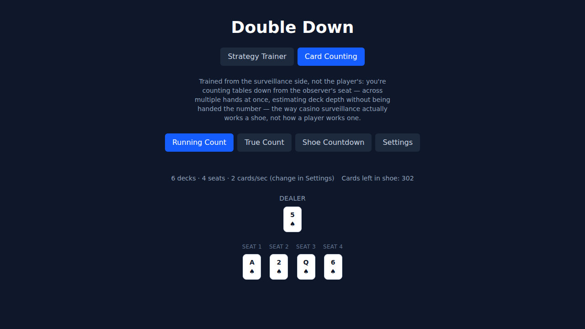

# Double Down

An adaptive blackjack basic-strategy trainer: it finds your weakest decisions and weights practice toward them until you can run 150 hands with zero errors.


**Live demo:** https://blackjack-trainer-gules.vercel.app/

## Stack

- Vite + React + TypeScript
- Tailwind CSS
- Vitest for unit tests
- localStorage for persistence (no backend, no API keys, zero running cost)

## Rule set (fixed for v1)

6 decks · dealer stands on soft 17 · double after split allowed · no surrender · blackjack pays 3:2.

The trainer grades every decision against a basic-strategy chart for exactly this rule set — see `src/lib/strategy.ts` and `CLAUDE.md` §11 for a couple of judgment calls made while encoding it (e.g. hard 11 vs. dealer Ace).

## Setup

```bash
npm install
npm run dev
```

Run the test suite with `npm test`, or build for production with `npm run build`.

## How the adaptive engine works

Every decision you make is tracked per situation (e.g. "hard 16 vs. dealer 10," "soft 18 vs. 9," "pair of 8s vs. 10") with a rolling-window accuracy. Each time you're dealt a new hand, the trainer draws mostly — but not exclusively — from your weakest situations, so struggling spots come back often while mastered ones still recur occasionally instead of disappearing. The headline goal is a 150-hand streak with zero mistakes; missing one resets the streak to 0, and a weakness heatmap shows exactly which hard/soft/pair situations need more work.

## Card Counting Trainer (v2)



A second mode, trained from the **casino surveillance / observer side, not the player's side**. Instead of learning to beat the house from a player's seat, you're learning to watch a table the way surveillance actually does: counting across multiple hands at once, estimating deck depth without being handed the number, and judging a shoe from the outside rather than playing it from the inside. The counting system is fixed to **Hi-Lo** (2–6 = +1, 7–9 = 0, 10/J/Q/K/A = −1).

Four drills, switchable via their own sub-tabs:

- **Running Count** — a full round is dealt across multiple seats plus the dealer, the way a real table actually deals (round-robin, twice), and you keep the running count across the whole round from the observer's vantage point.
- **True Count** — you're handed a running count and a discard-tray visual; estimate decks played, derive decks remaining, then compute the true count. Difficulty tiers control how many calibration tick marks the tray shows.
- **Shoe Countdown** — flip cards as fast as you can. The deal stops at an unpredictable point (not always the full shoe), so the count has to be tracked for real and can't be guessed at the end — speed is timed and personal bests are tracked per shoe size.
- **Settings** — shoe size, seat count, and dealing speed in one shared panel; lifetime accuracy and personal bests; a two-step "reset progress" confirm that clears progress without touching your strategy-trainer streak.

Settings and progress (personal bests, rounds played, accuracy) persist across reloads via localStorage, in a separate key from the v1 strategy trainer so the two trackers never interfere with each other.
