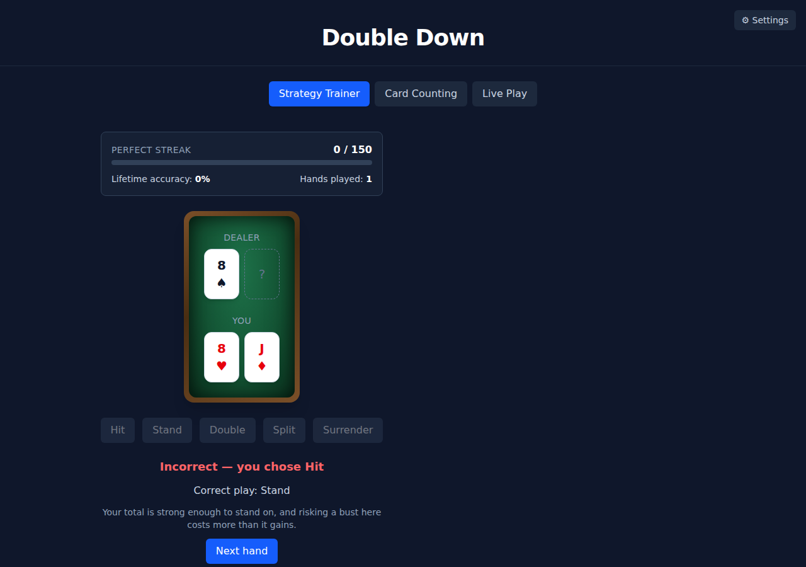

# Double Down

An adaptive blackjack basic-strategy trainer: it finds your weakest decisions and weights practice toward them until you can run 150 hands with zero errors.



**Live demo:** https://blackjack-trainer-gules.vercel.app/

## Stack

- Vite + React + TypeScript
- Tailwind CSS
- Vitest for unit tests
- localStorage for persistence (no backend, no API keys, zero running cost)

## Rule set (fixed for v1)

6 decks · dealer stands on soft 17 · double after split allowed · no surrender · blackjack pays 3:2.

The trainer grades every decision against a basic-strategy chart for exactly this rule set — see `src/lib/strategy.ts` and `CLAUDE.md` §11 for a couple of judgment calls made while encoding it (e.g. hard 11 vs. dealer Ace).

## Setup

```bash
npm install
npm run dev
```

Run the test suite with `npm test`, or build for production with `npm run build`.

## How the adaptive engine works

Every decision you make is tracked per situation (e.g. "hard 16 vs. dealer 10," "soft 18 vs. 9," "pair of 8s vs. 10") with a rolling-window accuracy. Each time you're dealt a new hand, the trainer draws mostly — but not exclusively — from your weakest situations, so struggling spots come back often while mastered ones still recur occasionally instead of disappearing. The headline goal is a 150-hand streak with zero mistakes; missing one resets the streak to 0, and a weakness heatmap shows exactly which hard/soft/pair situations need more work.
