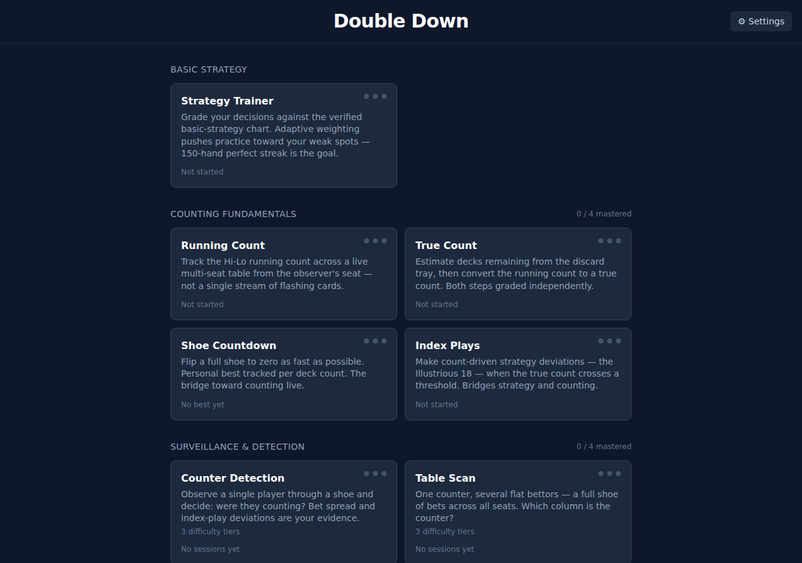
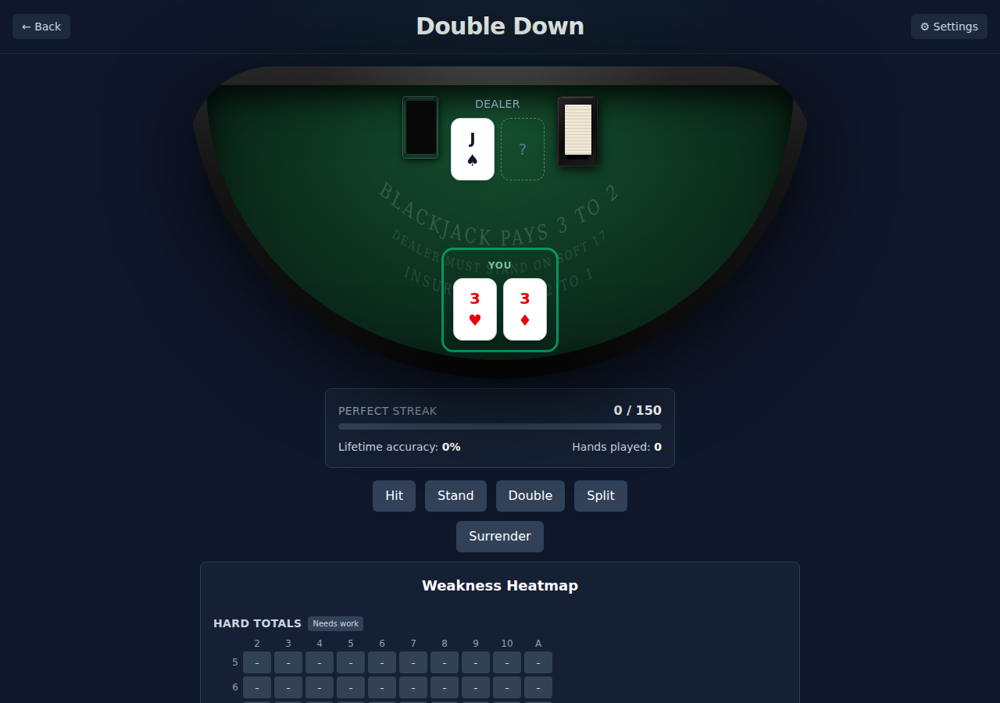
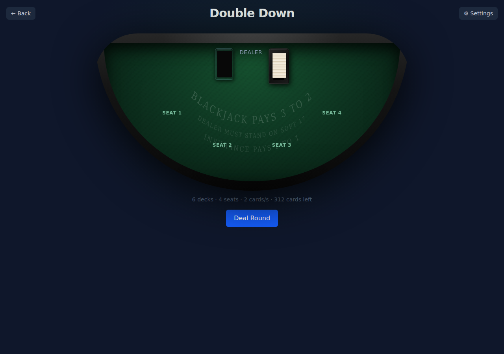

# Double Down

A blackjack and card-counting trainer built from the **casino surveillance
perspective** — not a player-side tool for beating the house, but a training
platform for learning to watch a table the way casino surveillance does:
tracking counts across multiple hands at once, reading bet patterns for
advantage signals, and judging a shoe from the outside rather than playing it
from the inside.

**Live demo:** https://blackjack-trainer-gules.vercel.app/



## What it trains

Ten modes across four sections of a structured curriculum:

### Basic Strategy

**Strategy Trainer** — Grade every decision against a verified basic-strategy
chart (6-deck, H17, DAS, no surrender). Adaptive weighting steers practice
toward your weak situations; a 150-hand perfect streak is the headline goal.
A weakness heatmap shows at a glance which hard/soft/pair situations need
more work.



### Counting Fundamentals

- **Running Count** — Cards are dealt round-by-round across multiple seats
  plus the dealer, the way a real table actually deals. Count the whole round
  from the observer's position, not a single stream of flashing cards.
- **True Count** — Given a running count and a visual discard tray, estimate
  decks remaining from the tray depth, then compute the true count. Both
  steps are graded independently.
- **Shoe Countdown** — Flip a full shoe to zero as fast as possible. The shoe
  stops at a randomized point (so the count can't be back-calculated); speed
  is timed and personal bests tracked per deck count.
- **Index Plays** — Make count-driven strategy deviations (the Illustrious
  18) when the true count crosses a threshold. Bridges the strategy and
  counting engines directly.



### Surveillance & Detection

Four **simulated training drills**, not a real, validated surveillance
system — the "detection" here is a rule-based classifier (flags elevated bet
sizing and count-driven strategy deviations) built to train the judgment
skill of correlating a player's bets and plays with the count, not a
production casino detection model.

- **Counter Detection** — Watch a simulated player through a full shoe and
  render a verdict: were they counting? Bet spread and index-play deviations
  are your evidence. Three difficulty tiers.
- **Table Scan** — Multiple seats, one simulated counter hidden among flat
  bettors. Identify the counter from a full shoe of bet data. Three
  difficulty tiers.
- **Evidence Flagging** — Flag the individual rounds within a simulated shoe
  that are genuine tells — a real uncamouflaged bet spike or a real index
  deviation, not a cover play. Scored on precision and recall separately.
- **Evasion** — Switch sides: play as a simulated counter yourself. Choose
  your bets and deviations to maximize EV while keeping heat — rounds that
  read as evidence to the Detection drill's classifier — low. Scored on two
  independent axes mirroring the Detection drill's grading.

### Capstone

**Live Play** — Play actual blackjack hands while keeping your own running
count, converting to true count, and sizing bets for EV. All four skills
tested together in one unbroken session — basic strategy decisions, running
count, true-count conversion, and EV bet sizing — the way a real observer
actually works a table. Late surrender is available as a legal option.

## Achievement system

Each mode has three mastery tiers derived from existing accuracy and volume
data — no new persistence, no gambling framing. Pip indicators on each mode
card show progress; section headers track how many modes in that section
you've mastered. The pinnacle: **Double Down** — tier 3 earned across all
ten modes.

## Stack

- **Vite + React + TypeScript** — fully client-side SPA, no backend
- **Tailwind CSS**
- **Vitest** — ~249 unit tests covering the strategy chart, counting math,
  and all session engines
- **localStorage** — all progress persists in two independent keys (strategy
  and counting); no accounts, no API keys, zero running cost
- Deploys as a static site (Vercel / Netlify / GitHub Pages)

## Rule set

6 decks · dealer hits on soft 17 (H17) · double after split allowed ·
blackjack pays 3:2. Each mode shows a small rule badge (e.g. `6D · H17 ·
DAS · 3:2 · Surrender: off`) confirming this for that mode.

Surrender availability is **mode-specific**, not a single flat rule: the
basic-strategy chart (`strategy.ts`) that every strategy-grading mode is
graded against is a no-surrender chart, so Surrender is never the correct
answer and isn't offered as an action in those drills. Live Play's own
hand-play engine (`livePlaySession.ts`) is the one exception — it legally
offers late surrender as a playable action, independent of the chart used
to grade basic-strategy decisions elsewhere.

See `src/lib/strategy.ts` for the chart encoding and `CLAUDE.md §11` for
a few judgment calls made while encoding it (e.g. hard 11 vs. dealer Ace).

## Setup

```bash
npm install
npm run dev
```

Run the test suite: `npm test`. Production build: `npm run build`.

## How the adaptive engine works

Every decision is tracked per situation (e.g. "hard 16 vs. dealer 10,"
"soft 18 vs. 9," "pair of 8s vs. 10") with a rolling accuracy window. Each
new hand draws mostly from your weakest situations, with a random floor so
mastered situations still recur occasionally instead of disappearing. The
150-hand perfect-streak goal is the headline challenge; a weakness heatmap
shows exactly which situations need more work.
